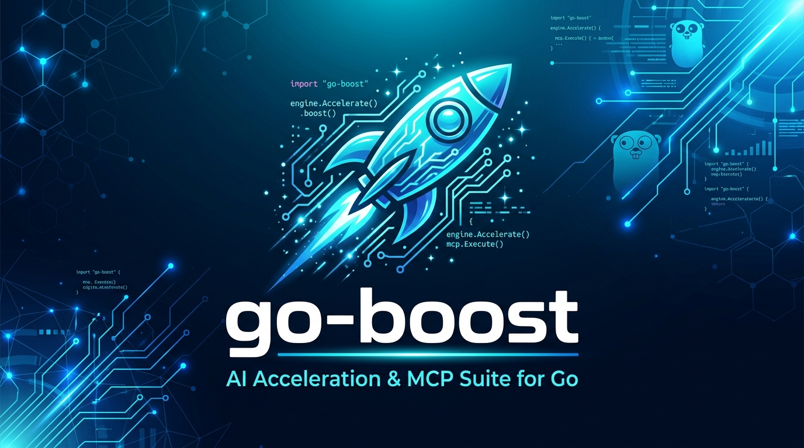
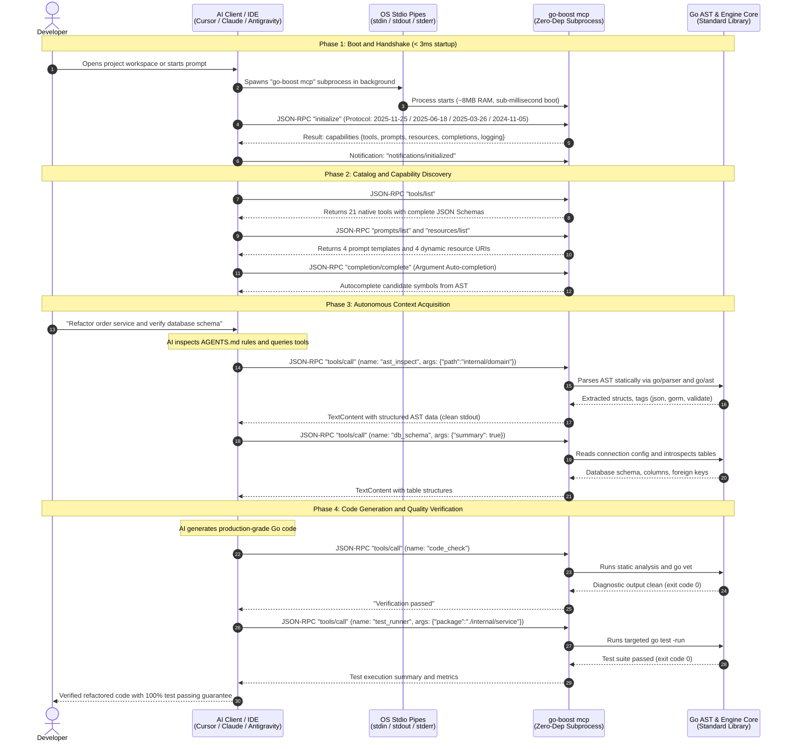

<p align="center">
  <a href="https://github.com/wahyunoerr/go-boost" target="_blank">
    
  </a>
</p>

<p align="center">
  <strong>The Native AI Acceleration &amp; Model Context Protocol (MCP) Suite for Go</strong>
</p>

<p align="center">
  <a href="https://go.dev/"></a>
  <a href="https://modelcontextprotocol.io/"></a>
  <a href="#architecture-and-advantages"></a>
  <a href="#"></a>
</p>

`go-boost` is a developer acceleration tool and Model Context Protocol (MCP) server built for the Go ecosystem. Engineered natively in Go, it delivers fast, accurate, and safe codebase context to AI coding assistants including Google Antigravity, Cursor, Claude Code, VS Code Copilot, and Windsurf.

---

## Table of Contents
- [Architecture and Advantages](#architecture-and-advantages)
- [Key Features](#key-features)
- [21 Built-in MCP Tools](#21-built-in-mcp-tools)
- [Interactive MCP Prompts](#interactive-mcp-prompts)
- [Dynamic MCP Resources](#dynamic-mcp-resources)
- [How Tools Run When go-boost Is Activated](#how-tools-run-when-go-boost-is-activated)
  - [1. Activation Lifecycle](#1-activation-lifecycle)
  - [2. Three Ways Tools Are Executed](#2-three-ways-tools-are-executed)
  - [3. End-to-End Real-World Scenario](#3-end-to-end-real-world-scenario)
  - [4. How to Verify Tool Activation](#4-how-to-verify-tool-activation)
- [Installation Guide](#installation-guide)
- [Quick Start](#quick-start)
- [Exit Codes](#exit-codes)
- [Editor & AI Assistant Setup](#editor--ai-assistant-setup)
  - [Google Antigravity and Gemini CLI](#1-google-antigravity-and-gemini-cli)
  - [Cursor](#2-cursor)
  - [Claude Code](#3-claude-code)
  - [VS Code Copilot and Cline](#4-vs-code-copilot-and-cline)
  - [Windsurf](#5-windsurf)
  - [Zed Editor](#6-zed-editor)
- [CLI Commands Reference](#cli-commands-reference)
- [Context Architecture: Guidelines and Skills](#context-architecture-guidelines-and-skills)
- [License](#license)

---

## Architecture and Advantages

`go-boost` is built directly on the Go standard library (`go/parser`, `go/ast`, `go/types`, `net/http`) with zero external runtime dependencies:

1. **Sub-millisecond Native Speed**: Runs as a standalone compiled binary with an initialization time under 3 milliseconds and approximately 8 MB memory footprint.
2. **Static AST Analysis**: Reads structs, interfaces, methods, comments, and field tags statically without executing or compiling the application code.
3. **Implicit Interface Matcher**: Computes method sets across the codebase to identify which concrete structs satisfy any given interface contract.
4. **Static Concurrency Hazard Detection**: Audits AST patterns for goroutine leaks, context timer leaks (missing defer cancel), and mutex lock hygiene.
5. **Schema vs Struct Diff Engine**: Compares live database schemas against Go struct tags (`db`, `gorm`, `json`) to identify schema desynchronizations.
6. **Automatic Multi-Stack Detection**: Identifies web frameworks (Gin, Fiber, Echo, Chi, gorilla/mux, go-zero, `net/http`), ORM/data access layers (GORM, Bun, SQLX, Ent, sqlc, pgx), caching engines (Redis, Memcached), message brokers (Kafka, RabbitMQ, NATS), RPC (gRPC), configuration libraries (Viper, envconfig), loggers (`slog`, `zap`, `zerolog`), and directory architecture patterns.
7. **Execution Safety**: Database tools accept only read-only statements (`SELECT`, `WITH`, `SHOW`, `EXPLAIN`, `DESCRIBE`, `PRAGMA`) and, in addition, open the database itself in a read-only mode, so a statement that slips past validation still cannot write. Row capping and timeouts apply on top.
8. **Zero External Dependencies**: Adds zero third-party dependencies to your project `go.mod`.

---

## Key Features

- **Dual-Mode Operation**: Serves as a terminal CLI for developers and an MCP server over `stdio` (JSON-RPC 2.0) for AI assistants.
- **Data Model Inspection**: Extracts struct field tags such as `json`, `gorm`, `validate`, and `db` so AI understands payloads, validation rules, and schema contracts accurately.
- **HTTP Endpoint Discovery**: Statically maps all routes across supported frameworks, complete with handler names and file locations.
- **Structured Log and Diagnostic Reader**: Parses JSON logs (`slog`, `zap`, `zerolog`) and standard text logs, capturing recent panics and stack traces.
- **Targeted Test Runner**: Executes specific tests using the `-run` filter and extracts failure diagnostics without overflowing the LLM context window.
- **Memory Allocation Profiling**: Runs benchmarks with `-benchmem` to extract `ns/op`, `B/op`, and `allocs/op` for algorithmic optimization.
- **Interface Mock & Test Scaffolding**: Automatically generates thread-safe mock structs for Go interfaces.
- **Static Security Auditing**: Identifies SQL injection, hardcoded secrets, and TLS hazards in Go source code.
- **OpenAPI 3.0 Generation**: Scans AST route trees and DTO structs to generate OpenAPI specifications.
- **AI Guidelines Generator**: Generates tailored `.mcp.json`, `AGENTS.md`, `CLAUDE.md`, and `.cursorrules`, and installs Agent Skills into `.claude/skills/*` based on your project stack. Existing content you wrote is preserved.
- **Layout-Aware, Not Layout-Imposing**: Reads the directory structure you already use, including non-standard names such as `controllers`, `services`, `storage`, and `models`, and records the real paths in the guidelines so the agent writes new code where your existing code lives.

---

## 21 Built-in MCP Tools

The `go-boost` MCP server exposes 21 native tools:

| Tool Name | Category | Description | Parameters |
| :--- | :--- | :--- | :--- |
| `diagnose_run` | Diagnostics | Supervises an application or make command and produces instant root-cause diagnostics with code snippets upon crash or error. The command is stopped when the timeout elapses, so pointing it at a long-running server is safe. | `command` (string, optional), `timeout_seconds` (integer, optional, default 30, max 300) |
| `app_info` | Metadata | Analyzes go.mod and AST to extract complete stack metadata, frameworks, ORM, database, logger, and architecture. | None |
| `ast_inspect` | AST & Models | Statically inspects struct declarations, field tags, interfaces, and method receivers without compiling. | `path` (string, optional) |
| `find_implementations` | AST & Models | Discovers which structs implement a given interface by computing method sets statically. | `interface` (string, required) |
| `deadcode_detect` | Code Quality | Statically scans for unreferenced functions, structs, and interfaces, matched per package. | `path` (string, optional) |
| `concurrency_check` | Concurrency | Audits AST for concurrency bugs: missing defer cancel, mutex unlock omissions, and goroutine leaks. | None |
| `route_list` | Routing | Scans registered HTTP endpoints across Gin, Echo, Fiber, Chi, and Go 1.22+ net/http. | None |
| `db_connections` | Database | Discovers database connection parameters from environment files and local configs. | None |
| `db_schema` | Database | Inspects database schema in summary mode or detailed filtered table mode. | `summary` (bool), `filter` (string), `connection` (string), `include_views` (bool) |
| `db_query` | Database | Executes read-only SQL queries (`SELECT`, `WITH`, `SHOW`, `EXPLAIN`). Mutations are rejected by validation and by opening the database read-only. | `query` (string, required), `connection` (string, optional) |
| `schema_struct_diff` | Database | Compares database table columns against Go struct field tags to pinpoint missing columns and mismatches. | `connection` (string, optional) |
| `migration_generate` | Scaffolding | Scaffolds timestamped up and down SQL migration files from the difference between the live schema and your struct tags. | `name` (string, optional), `connection` (string, optional) |
| `mock_generate` | Scaffolding | Generates a compiling, concurrency-safe mock for any Go interface, including embedded interfaces, variadics and generics. | `interface` (string, required) |
| `read_logs` | Diagnostics | Reads and parses recent log entries (`slog`, `zap`, `zerolog`, text files) with stack traces. | `entries` (int, default 50) |
| `last_error` | Diagnostics | Locates the most recent backend error, exception, or goroutine panic with file and line details. | None |
| `test_runner` | Testing | Runs Go unit tests with targeted package paths, `-run` filters, and coverage metrics. | `package` (string), `run` (string), `coverage` (bool) |
| `bench_runner` | Performance | Runs benchmarks with memory allocation profiling (`-benchmem`) to extract ns/op, B/op, and allocs/op. | `package` (string), `filter` (string) |
| `code_check` | Quality | Runs compilation checks and `go vet` to verify code correctness before changes are committed. | `package` (string, optional) |
| `go_doc` | Documentation | Retrieves official symbol or package documentation from Go stdlib or dependencies via `go doc`. | `symbol` (string, required) |
| `security_scan` | Security | Scans for SQL injection, hardcoded secrets, command injection, path traversal, and insecure TLS. | `path` (string, optional) |
| `openapi_generate` | Documentation | Generates an OpenAPI 3.0 document describing the routes discovered in the AST, with their methods and path parameters. | `title` (string, optional), `version` (string, optional) |

---

## Interactive MCP Prompts

`go-boost` registers interactive prompt templates for MCP clients (`prompts/list` and `prompts/get`):

1. **`generate_table_tests`**: Guides the AI to write idiomatic table-driven tests for a specific function or struct with positive and negative test cases.
2. **`refactor_clean_arch`**: Prompts the AI to refactor a feature into Clean Architecture layers (Entity, Repository, Usecase, Handler).
3. **`concurrency_audit`**: Prompts the AI to perform a comprehensive concurrency safety audit on a target package.
4. **`diagnose_panic`**: Guides the AI through analyzing the most recent backend error or panic captured by `last_error` and formulating a defensive fix.

---

## Dynamic MCP Resources

`go-boost` exposes dynamic context resources readable via standard URIs (`resources/list` and `resources/read`):

- **`project://metadata`**: Real-time JSON document containing detected module, Go version, framework, ORM, and dependency versions.
- **`project://routes`**: Real-time JSON array of all registered HTTP endpoints and handlers.
- **`project://schema`**: Current database schema dump.
- **`project://diagnostics`**: Live compilation and static analysis report.

---

## How Tools Run When go-boost Is Activated

This section explains how tools are initialized and executed between the developer, the editor, and the AI assistant.

### 1. Activation Lifecycle

When you open a project or trigger a chat prompt in an MCP-compatible environment (Google Antigravity, Cursor, Claude Code, VS Code Copilot, Windsurf, Zed), `go-boost` activates as a background subprocess communicating over standard input and output (`stdio`).

#### Sequence Flow Diagram



#### Process Architecture & Stream Isolation

```text
┌────────────────────────────────────────────────────────────────────────────────────────────────────────┐
│                                       DEVELOPER WORKSPACE                                              │
│                                                                                                        │
│   ┌─────────────────────────────────────────┐          ┌───────────────────────────────────────────┐   │
│   │             AI Coding Client            │          │             Go Project Files              │   │
│   │   Cursor / Claude Code / Antigravity    │          │  go.mod, *.go, migrations, .env, schemas  │   │
│   └────────────────────┬────────────────────┘          └─────────────────────▲─────────────────────┘   │
└────────────────────────┼─────────────────────────────────────────────────────┼─────────────────────────┘
                         │                                                     │
             stdio pipes │ JSON-RPC 2.0 (MCP)                                  │ Direct static AST read
                         ▼                                                     │ & read-only introspection
┌──────────────────────────────────────────────────────────────────────────────┼─────────────────────────┐
│  go-boost mcp Subprocess                                                     │                         │
│                                                                              │                         │
│   ┌──────────────────────────────────────────────────────────────────────┐   │                         │
│   │                         JSON-RPC Stdio Router                        │   │                         │
│   │   stdin: Requests & Notifications     stdout: Pure JSON-RPC Responses│   │                         │
│   │   stderr: Isolated Diagnostic Telemetry (Zero JSON stream corruption)│   │                         │
│   └────────┬───────────────────────────┬───────────────────────────┬─────┘   │                         │
│            │                           │                           │         │                         │
│            ▼                           ▼                           ▼         │                         │
│   ┌─────────────────┐         ┌─────────────────┐         ┌────────────────┐ │                         │
│   │    20 Tools     │         │    4 Prompts    │         │  4 Resources   │ │                         │
│   │    Registry     │         │    Registry     │         │    Registry    │ │                         │
│   └───┬─────────┬───┘         └─────────────────┘         └────────────────┘ │                         │
│       │         │                                                            │                         │
│       │         └─────────────────────────┐                                  │                         │
│       ▼                                   ▼                                  │                         │
│   ┌────────────────────────────┐      ┌─────────────────────────────────┐    │                         │
│   │    Go AST Static Engine    │      │    Database Introspect Engine   │    │                         │
│   │  - Struct & Tag Inspector  │      │  - Connection Discovery         │────┘                         │
│   │  - Route Table Scanner     │      │  - Schema & Column Discovery    │                              │
│   │  - Interface Matcher       │      │  - Read-Only Query Guard        │                              │
│   │  - Concurrency Hazard Check│      │  - Schema vs Struct Diff        │                              │
│   │  - Dead Code Detection     │      │  - SQL Migration Scaffolder     │                              │
│   └────────────┬───────────────┘      └─────────────────────────────────┘                              │
│                │                                                                                       │
│                ▼                                                                                       │
│   ┌────────────────────────────┐      ┌─────────────────────────────────┐                              │
│   │   Tooling & Quality Core   │      │   Security & Scaffolding Engine │                              │
│   │  - Targeted Test Runner    │      │  - Static Security Scanner      │                              │
│   │  - Bench Allocation Profiler│     │  - Thread-Safe Mock Generator   │                              │
│   │  - go doc & go vet Checks  │      │  - OpenAPI 3.0 Auto Generator   │                              │
│   │  - Log & Panic Pinpointer  │      └─────────────────────────────────┘                              │
│   └────────────────────────────┘                                                                       │
│                                                                                                        │
│                      Boot Time: < 3ms  |  Memory: ~8MB  |  External Deps: 0                            │
└────────────────────────────────────────────────────────────────────────────────────────────────────────┘
```

#### Detailed Lifecycle Phases

1. **Configuration Detection**: The editor reads `.mcp.json`, `.cursor/mcp.json`, `.gemini/antigravity/mcp/go-boost.json`, or `.vscode/mcp.json`. These files define `go-boost` with argument `["mcp"]`.
2. **Zero-Latency Subprocess Spawn**: The client launches `go-boost mcp` as an isolated background child process. Because `go-boost` is a statically compiled pure Go binary with zero external dependencies, initialization completes in **under 3 milliseconds** with approximately 8 MB memory footprint.
3. **Protocol Handshake & Capability Negotiation**: The client transmits a JSON-RPC `initialize` frame. `go-boost` negotiates across the published MCP revisions it supports (`2025-11-25`, `2025-06-18`, `2025-03-26`, `2024-11-05`), echoing the client's version when it is one of them and otherwise replying with the newest it speaks. It advertises only capabilities it actually implements: tools, prompts, resources, interactive argument completion (`completions`), and logging level control. The client acknowledges with `notifications/initialized`.
4. **Dynamic Catalog Discovery & Argument Completion**: The client queries `tools/list`, `prompts/list`, and `resources/list`. `go-boost` replies with all 21 native tools in a stable, alphabetically sorted order, complete with JSON Schema validation specifications, prompt templates, and dynamic URI definitions. When an agent types tool arguments, `completion/complete` autocompletes candidates drawn from the project itself, such as its discovered connections and interfaces.
5. **Autonomous Context Acquisition Loop**: During active developer chat sessions, the AI agent consults `AGENTS.md` and triggers tools autonomously (`tools/call`). `go-boost` inspects Go ASTs or database structures statically, returning contextual answers instantly.
6. **Stream Separation Guarantee**: All JSON-RPC request and response payloads flow exclusively through `stdin` and `stdout`. Internal engine logs, panic diagnostics, and debug traces are directed strictly to `stderr`. This architectural separation guarantees that stdout is never corrupted by unexpected terminal text or logs.

---

### 2. Three Ways Tools Are Executed

Once `go-boost` is active, tools can be triggered through three different mechanisms:

#### Method A: Autonomous Execution by AI Agent
Running `go-boost init` generates `AGENTS.md`, `CLAUDE.md`, and `.cursorrules` in your project root. These files instruct the AI assistant to invoke tools autonomously:

- **At Session Start**: The AI calls `app_info` proactively to inspect your Go version, router, and ORM dependencies.
- **When Reading or Writing Structs**: The AI calls `ast_inspect` to examine field names, types, and validation tags (`json`, `validate`, `gorm`), eliminating typos in DTOs.
- **When Finding Implementation Details**: The AI calls `find_implementations` to locate which struct implements a repository or service interface.
- **When Adding HTTP Endpoints**: The AI calls `route_list` to check existing paths and avoid route collisions.
- **When Checking Concurrency Health**: The AI calls `concurrency_check` to verify goroutines, mutex locks, and context cancellation.
- **When Auditing Security**: The AI calls `security_scan` to verify there are no SQL injections, hardcoded secrets, or insecure TLS configurations.
- **When Scaffolding Tests**: The AI calls `mock_generate` to build thread-safe mock implementations for interfaces.
- **When Generating API Docs**: The AI calls `openapi_generate` to produce OpenAPI 3.0 specifications from route definitions.
- **When Cleaning Up Code**: The AI calls `deadcode_detect` to locate unreferenced functions, structs, and interfaces.
- **When Debugging Errors or Panics**: The AI calls `last_error` and `read_logs` to pinpoint file names and line numbers immediately without asking the developer to copy-paste terminal logs.
- **Before Completing Tasks**: The AI calls `code_check` (`go vet`) and `test_runner` (`go test`) to ensure the generated code compiles cleanly and passes all test assertions.

#### Method B: Interactive Prompts in Chat
Developers can prompt the AI assistant directly to execute specific tools using natural language:

| Developer Chat Prompt | Tool Invoked by AI |
| :--- | :--- |
| "Scan our codebase for SQL injection and security vulnerabilities" | `security_scan` |
| "Generate a mock struct for PaymentGateway interface" | `mock_generate` |
| "Generate an OpenAPI 3.0 specification for our routes" | `openapi_generate` |
| "Scaffold a new SQL migration for the orders table" | `migration_generate` |
| "Find any dead or unreferenced code in the repository" | `deadcode_detect` |
| "Check which struct implements the PaymentGateway interface" | `find_implementations` |
| "Audit our background worker for concurrency leaks" | `concurrency_check` |
| "Check if database columns match our Go struct models" | `schema_struct_diff` |
| "Run memory benchmarks on the serializer package" | `bench_runner` |
| "Check the database table structure for this app" | `db_schema` (summary mode) |
| "Run a query to select the top 5 users" | `db_query` |
| "Show all registered routes in this project" | `route_list` |
| "Check if there are any recent panics in backend logs" | `last_error` |
| "Run unit tests for the internal/service package" | `test_runner` |
| "Inspect the User struct and its validation tags" | `ast_inspect` |
| "Check for any go vet or compilation issues" | `code_check` |
| "Look up the official documentation for net/http.Client" | `go_doc` |

#### Method C: Direct Terminal Execution (Without AI)
Developers can also use `go-boost` directly from the terminal without opening an AI chat:

```bash
# All examples assume a global install. With a project tool install,
# prefix each command with "go tool".

# View all HTTP routes parsed statically from AST
go-boost routes

# Inspect any struct or interface statically
go-boost inspect User

# Run static concurrency audit and compiler vet
go-boost check

# Run benchmarks with memory profiling
go-boost bench ./pkg/...

# Run security audit for SQL injection and secrets
go-boost security

# Generate mock implementation for an interface
go-boost mock UserRepository

# Generate OpenAPI 3.0 specification
go-boost openapi

# Scaffold SQL migration from schema struct diff
go-boost migrate add_users_table

# Detect dead or unused code
go-boost deadcode

# View project stack health and diagnostics
go-boost status

# Inspect database tables directly in the terminal
go-boost schema --summary
```

---

### 3. End-to-End Real-World Scenario

Here is an example workflow when a developer requests a new feature:

```text
User: "Please add a POST /api/v1/checkout endpoint with input validation"

[Step 1] AI invokes app_info
         -> Discovers stack: Gin, GORM, slog, validator.v10.

[Step 2] AI invokes ast_inspect on path "./internal/domain"
         -> Examines Order and Item structs, noting `validate:"required,min=1"`.

[Step 3] AI invokes find_implementations for "OrderRepository"
         -> Locates GormOrderRepository in internal/repository/order.go.

[Step 4] AI invokes route_list
         -> Reviews current route groups registered in routes.go.

[Step 5] AI writes handler and checkout service code.

[Step 6] AI invokes concurrency_check
         -> Verifies context cancellation and mutex locking hygiene.

[Step 7] AI invokes security_scan
         -> Confirms no SQL injection or parameter pollution vulnerabilities.

[Step 8] AI invokes code_check
         -> Runs `go vet ./...` (Result: No issues found).

[Step 9] AI invokes test_runner on package "./internal/service"
         -> Runs `go test` (Result: All tests passed successfully).

AI: "The checkout endpoint has been created, security audited, and all tests are passing."
```

---

### 4. How to Verify Tool Activation

To verify that the `go-boost` MCP server is running properly in your editor:

1. **Cursor**:
   - Open the Command Palette (`Cmd + Shift + P` or `Ctrl + Shift + P`).
   - Type `MCP: List Servers`.
   - Verify that `go-boost` shows an active status with a green indicator.
2. **Claude Code**:
   - Type `/mcp` in the Claude Code prompt.
   - Verify that `go-boost` is listed with 20 active tools.
3. **Google Antigravity and Gemini CLI**:
   - Type in chat: *"Run app_info via go-boost"*.
   - The assistant will invoke the tool and display your application metadata.
4. **Manual Terminal Test**:
   Test the JSON-RPC stdio handshake directly via pipeline:
   ```bash
   echo '{"jsonrpc":"2.0","id":1,"method":"tools/list"}' | go-boost mcp
   ```
   The binary will respond with formatted JSON containing all 20 registered tools.

---

## Installation Guide

### 1. As a project tool (recommended, Go 1.24+)

This pins go-boost in your `go.mod` the way `composer require --dev` pins a PHP
dev dependency. Everyone who clones the repository gets the same version, and
nobody has to install anything globally.

```bash
go get -tool github.com/wahyunoerr/go-boost/v2/cmd/go-boost@latest
```

Your `go.mod` gains a `tool` directive:

```
tool github.com/wahyunoerr/go-boost/v2/cmd/go-boost
```

The `/v2` in the path is Go's semantic import versioning: any module at major
version 2 or above carries its major version in the path. The command you run
afterwards is still just `go tool go-boost`.

Run it through the Go toolchain:

```bash
go tool go-boost init
go tool go-boost status
```

This is the option to choose if you work in a team. Because the command is
`go tool go-boost` rather than a path on your disk, the generated MCP
configuration works on every machine and can be committed.

### 2. As a global binary (Go 1.22+)

```bash
go install github.com/wahyunoerr/go-boost/v2/cmd/go-boost@latest
```

Ensure `$GOPATH/bin` is on your `PATH`:

```bash
export PATH=$PATH:$(go env GOPATH)/bin
```

Then use `go-boost` directly:

```bash
go-boost init
```

### 3. Building from source

```bash
git clone https://github.com/wahyunoerr/go-boost.git
cd go-boost
go build -o bin/go-boost ./cmd/go-boost
sudo mv bin/go-boost /usr/local/bin/
```

### Pinning a specific version

```bash
go get -tool github.com/wahyunoerr/go-boost/v2/cmd/go-boost@v2.0.0
```

### Verification

```bash
go tool go-boost version   # project tool install
go-boost version           # global install
```

### Which install method ends up in your MCP config

`go-boost init` writes the invocation that will actually work on other
machines, in this order:

| Situation | Generated command | Portable |
| :--- | :--- | :--- |
| `tool` directive in `go.mod` | `go tool go-boost mcp` | Yes, safe to commit |
| `go-boost` found on `PATH` | `go-boost mcp` | Yes, if teammates also installed it |
| Neither | absolute path to your binary | No, keep it gitignored |

`init` tells you which one it chose. If it falls back to an absolute path, add
the tool directive and run `init` again to make the config shareable.

---

## Quick Start

### Step 1: Navigate to Your Go Project
```bash
cd /path/to/your/go-project
```

### Step 2: Initialize go-boost
```bash
go tool go-boost init    # or: go-boost init
```
This command inspects your codebase, detects frameworks and libraries, reads
your actual directory structure, and creates:
- MCP configurations: `.mcp.json`, `.cursor/mcp.json`, `.vscode/mcp.json`
- AI guideline documents: `AGENTS.md`, `CLAUDE.md`, `.cursorrules`
- Agent Skills installed into the `.claude/skills/` directory

`init` never discards work you did yourself. Generated guidelines live between
`<!-- BEGIN go-boost generated guidelines -->` markers and only that block is
rewritten, so anything you add around it survives. An existing `.mcp.json` keeps
every other server you had configured. Re-running `init` is safe and idempotent.

### It adapts to your layout instead of imposing one

go-boost does not require a particular directory structure. `init` reads the
directories you actually have and records them in the guidelines, so the agent
places new code where your existing code lives. It recognises layer names
beyond the Go community defaults, including `controllers`, `services`,
`storage`, `models`, `delivery`, and `transport`, and it detects whether your
project is organised by layer, by feature, or kept flat.

For a project laid out by feature, the generated guidelines contain:

```markdown
## Project Layout

- **Entry points**: `./cmd/api`, `./cmd/worker`
- **Source roots**: `internal`
- **HTTP handlers**: `internal/order/handler`, `internal/user/handler`
- **Business logic**: `internal/order/service`
- **Data access**: `internal/user/repository`
- **Feature modules**: `order`, `user`
- **Migrations**: `db/migrations`

This project groups code by feature. A new feature gets its own directory
containing every layer it needs; do not add a shared top-level layer directory.
```

The same command on a flat single-package project instead records that the
project is flat and tells the agent not to introduce a directory tree.

### Step 3: View Project Stack Status
```bash
go-boost status
```

---

## Editor & AI Assistant Setup

### 1. Google Antigravity and Gemini CLI
Register the server using the CLI:
```bash
gemini mcp add -s project -t stdio go-boost go-boost mcp
```
Or create a configuration at `.gemini/antigravity/mcp/go-boost.json`:
```json
{
  "mcpServers": {
    "go-boost": {
      "command": "go-boost",
      "args": ["mcp"]
    }
  }
}
```

### 2. Cursor
Running `go-boost init` automatically generates `.cursor/mcp.json` and `.cursorrules`.
To configure manually in Cursor settings:
1. Press `Cmd + Shift + P` (or `Ctrl + Shift + P`).
2. Select `MCP: Open MCP Settings`.
3. Add the following entry:
```json
{
  "mcpServers": {
    "go-boost": {
      "command": "go-boost",
      "args": ["mcp"]
    }
  }
}
```

### 3. Claude Code
Claude Code automatically discovers `CLAUDE.md` and `.mcp.json` in the project root.
To add manually via the Claude CLI:
```bash
claude mcp add -s local -t stdio go-boost go-boost mcp
```

### 4. VS Code Copilot and Cline
`.vscode/mcp.json` is generated during `go-boost init`:
```json
{
  "mcpServers": {
    "go-boost": {
      "command": "go-boost",
      "args": ["mcp"]
    }
  }
}
```
Reload the VS Code window (`Developer: Reload Window`) to discover the tools.

### 5. Windsurf
Add this block to your Windsurf configuration (`~/.codeium/windsurf/mcp_config.json`):
```json
{
  "mcpServers": {
    "go-boost": {
      "command": "go-boost",
      "args": ["mcp"]
    }
  }
}
```

### 6. Zed Editor
Add this block to `.zed/settings.json`:
```json
{
  "context_servers": {
    "go-boost": {
      "command": "go-boost",
      "args": ["mcp"]
    }
  }
}
```

---

## CLI Commands Reference

Every example below is written as `go-boost <command>`, which is what you type
after a global install. If you installed go-boost as a project tool, prefix each
one with `go tool`:

```bash
go-boost status           # global install
go tool go-boost status   # project tool install
```

Commands that produce a document write it to standard output, so you choose
where it goes:

```bash
go tool go-boost openapi > openapi.json
go tool go-boost mock UserRepository > internal/domain/user_mock.go
```

### `go-boost init`
Scans the project, generates MCP configurations, and writes tailored AI guidelines and skills. Re-running it is safe: your own content is preserved and only the generated block is refreshed.

### `go-boost run [command...]`
Supervises application or build execution with zero-latency streaming. Upon crash, compilation error, runtime panic, or port conflict, it immediately halts and displays an instant visual diagnostic box showing the exact file, line number, source code snippet with pointer arrow, root cause analysis, and actionable fix:
```text
$ go-boost run make run
========================================================================
🚨 GO-BOOST INSTANT DIAGNOSTIC: Runtime Panic
========================================================================
📍 Location : cmd/api/main.go:45
💥 Message  : runtime error: invalid memory address or nil pointer dereference

📄 Source Context:
------------------------------------------------------------------------
     43 |   cfg, err := config.Load()
->   45 |   dbVersion := cfg.Database.Version
     46 |   log.Printf("DB Version: %s", dbVersion)
------------------------------------------------------------------------

💡 Root Cause:
   Attempted to read or write a struct field or invoke a method on a pointer that is nil.

🛠️ Suggested Fix:
   Check if the pointer variable is nil before accessing its fields or methods.

📡 Saved to .go-boost/last_error.json (Synchronized with MCP)
========================================================================
```

If run without arguments, `go-boost run` automatically detects `Makefile` with a `run:` target, or locates the application entry point in `cmd/` or `main.go`.

### `go-boost mcp`
Runs the standard Model Context Protocol server over `stdio` (JSON-RPC 2.0).

### `go-boost status [--format=text|json]`
Prints a diagnostic summary including module name, Go version, framework, ORM, logger, detected architecture, and route counts.

### `go-boost routes [--format=text|json]`
Scans the AST and prints all registered HTTP endpoints. Group prefixes are resolved across functions, so routes registered in a helper keep the prefix the caller gave them:
```text
METHOD   PATH                           HANDLER                        LOCATION
-----------------------------------------------------------------------------------------
GET      /api/v1/users                  HandleGetUsers                 internal/handler/user.go:24
POST     /api/v1/users                  HandleCreateUser               internal/handler/user.go:38
GET      /health                        HandleHealth                   cmd/api/main.go:42
```

### `go-boost inspect <symbol>`
Inspects any Go struct or interface statically:
```text
$ go-boost inspect User
📦 Struct: User
   Location: internal/domain/user.go:12
   Fields:
     - ID: uint `json:"id" gorm:"primaryKey"`
     - Email: string `json:"email" validate:"required,email"`
```

### `go-boost check [--format=text|json]`
Runs the concurrency audit and `go vet` in one command. The audit reports a mutex held across an early return, a cancel function that is never called, and goroutines started in a loop with nothing waiting on them. Returns exit code `2` when it finds something.

### `go-boost bench [package]`
Runs benchmarks with memory allocation profiling (`-benchmem`):
```text
$ go-boost bench ./pkg/parser/...
BENCHMARK                           ITERATIONS   SPEED           MEMORY       ALLOCS
---------------------------------------------------------------------------------------------
BenchmarkParseAST-8                 50000        24100.00 ns/op  4096 B/op    18 allocs/op
```

### `go-boost schema [--summary] [--filter=<table_name>]`
Inspects the database schema directly in your terminal.

### `go-boost security [path] [--format=text|json|sarif]`
Scans for SQL injection, hardcoded credentials, command injection, path traversal, and weak TLS configuration. An optional directory narrows the scan. Returns exit code `2` when it finds something, so it works as a CI gate:
```text
$ go-boost security
🛡️  Running static security and vulnerability audit...
🚨 Found 1 potential security vulnerability(ies):

   [HIGH] Suspected hardcoded secret or credential in 'apiKey' (File: internal/auth/token.go:3)
        Remediation: Load secrets from environment variables or a secret manager, and rotate this value if it was ever real.
```

Use `--format=sarif` to upload the result to GitHub code scanning. Paths in the SARIF output are repository-relative, so findings map onto the right files.

### `go-boost mock <interface>`
Generates a compiling, concurrency-safe mock for an interface and prints it to standard output. Embedded interfaces, variadics, unnamed parameters, and generics are all handled, and the output includes a compile-time assertion that the mock satisfies the interface:
```bash
$ go-boost mock UserRepository > internal/domain/user_repository_mock.go
```

An interface that embeds one from another package cannot be expanded from the AST alone; go-boost reports that instead of emitting a mock that would not compile.

### `go-boost openapi [--title=...] [--version=...]`
Scans the routes discovered in the AST and prints an OpenAPI 3.0 document to standard output. The title defaults to your module name and the version to `1.0.0`:
```bash
$ go-boost openapi --title="Store API" --version="2.1.0" > openapi.json
```

The generated document describes paths, methods, and path parameters. Request and response schemas are not inferred from handler bodies.

### `go-boost migrate [name]`
Compares the live database schema against your Go struct tags and writes timestamped up and down migrations for the columns that are missing. The name is optional and is used in the file names:
```text
$ go-boost migrate add_users_table
🔄 Comparing database schema with Go struct models...
✨ Successfully generated migration files:
   Up  : migrations/20260916103000_add_users_table.up.sql
   Down: migrations/20260916103000_add_users_table.down.sql
```

This requires a reachable database. It reports that the schema is already in sync when there is nothing to generate.

### `go-boost deadcode [path] [--format=text|json]`
Scans the AST for unreferenced functions, structs, and interfaces, matching symbols per package so that same-named types in different packages are not confused. Returns exit code `2` when it finds something:
```text
$ go-boost deadcode
🔍 Scanning AST for unreferenced/dead declarations...
⚠️ Found 2 unreferenced declaration(s):

KIND         NAME                           LOCATION
--------------------------------------------------------------------------------
func         legacyHelper                   internal/util/old.go:14
struct       UnusedConfig                   internal/config/draft.go:7
```

### `go-boost update`
An alias for `init`. Re-scans dependencies and layout, then refreshes the generated guideline block and installed skills.

---

## Exit Codes

The analysis commands are usable as CI gates:

| Code | Meaning |
| :--- | :--- |
| `0` | Success, and no findings |
| `1` | The command itself failed (bad arguments, unreadable project, tool error) |
| `2` | The command ran successfully and reported findings |

`security`, `check`, and `deadcode` return `2` when they find something, so a pipeline step fails without needing to parse output:

```yaml
- name: Security audit
  run: go-boost security --format sarif > results.sarif
```

`go-boost run` propagates the supervised process's own exit code.

## Context Architecture: Guidelines and Skills

Context is split into two tiers to optimize LLM token usage:

### 1. Guidelines (Loaded Upfront)
Stored in `AGENTS.md`, `CLAUDE.md`, and `.cursorrules`. Covers baseline rules:
- Propagating `ctx context.Context` through I/O calls and handlers.
- Wrapping errors with `fmt.Errorf("...: %w", err)` and inspecting via `errors.Is` and `errors.As`.
- Idiomatic Go naming conventions.
- Calling `app_info` and `ast_inspect` at the start of tasks.

### 2. Skills (Loaded On-Demand)
Installed into `.claude/skills/{skill-name}/SKILL.md` in the [Agent Skills format](https://agentskills.io/what-are-skills), each with `name` and `description` frontmatter so the agent loads it only when the task matches:
- `go-clean-architecture`: Layer separation for Entity, Repository, Usecase, and Delivery.
- `go-table-tests`: Idiomatic table-driven unit test patterns using `t.Run`.
- `go-concurrency-safety`: Best practices for goroutine termination, mutex hygiene, and `errgroup`.
- `go-error-handling`: Patterns for custom errors, sentinel errors, and wrapping.

To add your own skill, create `.ai/skills/{skill-name}/SKILL.md` with `name` and `description` frontmatter. Running `go-boost init` or `go-boost update` installs it alongside the built-in skills. A custom skill whose name matches a built-in one replaces it.

Skills are selected from the detected stack: `go-clean-architecture` is installed only when a layered `internal/` structure is present.

---

## License

This project is licensed under the MIT License. You are free to use it for both commercial and open-source projects.
